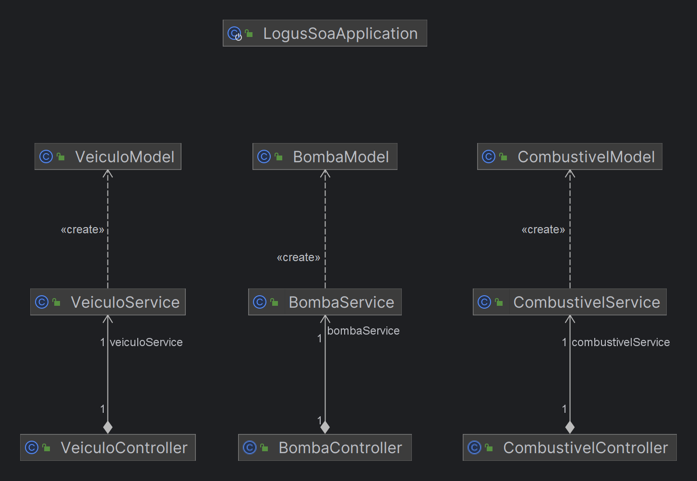

[](https://github.com/alexjosesilva/logus-microservice-gas-station/releases/tag/1.0)
[]([https://github.com/seu-usuario/seu-repositorio/blob/master/LICENSE](https://github.com/alexjosesilva/logus-microservice-gas-station/blob/master/LICENSE))
[](https://codecov.io/gh/alexjosesilva/logus-microservice-gas-station)


# Projeto Gestão de Combustiveis para Veículos em Java com Spring Boot

Este é um projeto de exemplo que implementa operações CRUD (Create, Read, Update, Delete) para gerenciar informações de veículos. Ele utiliza Java 17 e Spring Boot para criar uma API RESTful que salva e lê os dados de veículos em um arquivo CSV, sem a necessidade de um banco de dados.

## Funcionalidades

- Adicionar um novo veículo, fornecendo informações como nome do modelo, consumo de etanol, consumo de gasolina e consumo de diesel.
- Adicionar um novo combustivel
- Adicionar uma nova bomba de combustivel
- Listar todos os veículos cadastrados.
- Listar todos os combustiveis
- Listar todas as bombas
- Mudança critério enfileiramento 

## Como executar o projeto

1. Clone este repositório em sua máquina local:

```
git clone https://github.com/seu-usuario/nome-do-repositorio.git
```

2. Abra o projeto em sua IDE preferida (recomendado: IntelliJ IDEA).

3. Certifique-se de ter o Java 17 e o Apache Maven instalados em sua máquina.

4. Execute a aplicação Spring Boot. A aplicação será iniciada em `http://localhost:8080`.

5. Você pode testar as operações CRUD utilizando ferramentas como Postman ou cURL.

## Endpoints da API

- `GET /veiculos`: Retorna todos os veículos cadastrados.
- `POST /veiculos`: Adiciona um novo veículo.
- `GET /combustivel`: Retorna todos os combustiveis cadastrados.
- `POST /combustivel`: Adiciona um novo combustivel.
- `GET /bomba`: Retorna todos os veículos cadastrados.
- `POST /bomba`: Adiciona um nova bomba no posto de Gazolina

## Exemplo de JSON para adicionar um veículo via POST

```json
{
  "nomeModelo": "Exemplo",
  "consumoEtanol": 10.5,
  "consumoGasolina": 15.2,
  "consumoDiesel": 18.3
}
```

## Estrutura do Projeto

- `src/main/java`: Contém o código-fonte Java.
- `src/main/resources`: Contém os recursos, como arquivos de propriedades e o arquivo CSV.
- `src/main/resources/doc`: Documentação do projeto.
- `src/test`: Contém os testes unitários.

## Dependências

- Spring Boot: Framework para criar aplicativos Spring rapidamente.
- Spring Web: Fornece suporte para criar aplicativos da web usando Spring MVC.
- Spring DevTools: Fornece ferramentas de desenvolvimento automáticas para reinicialização automática.
- opencsv: Biblioteca que ajuda a a ler os arquivos CSV.

---

Este é um projeto de exemplo para fins educacionais. Sinta-se à vontade para explorar, modificar e experimentar com o código conforme necessário. Se tiver alguma dúvida ou sugestão, não hesite em entrar em contato. Aproveite!

---

## UML

